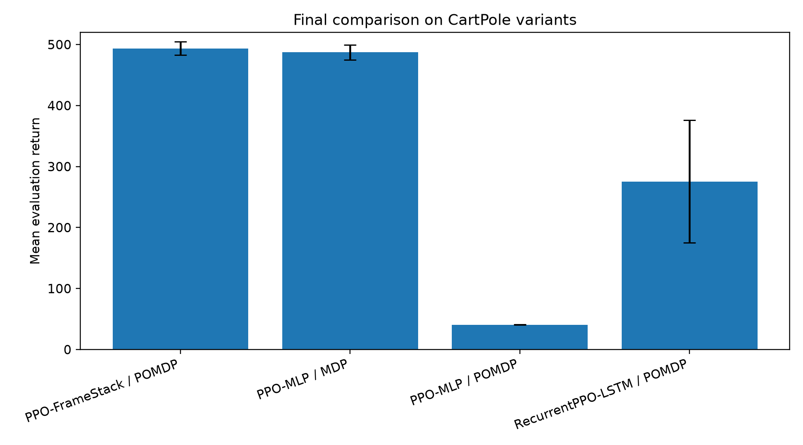
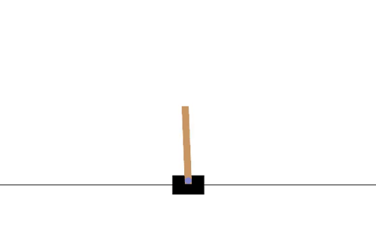
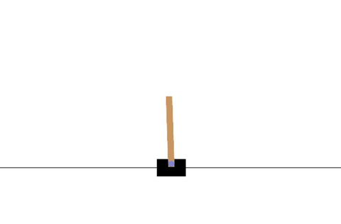
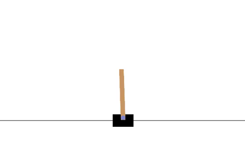
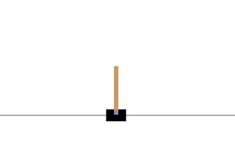
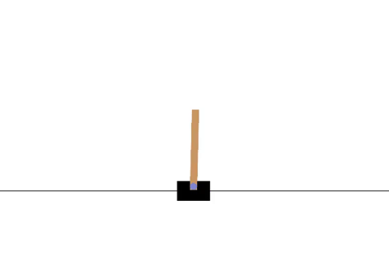
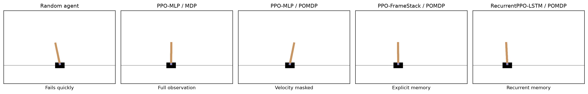
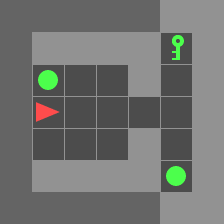
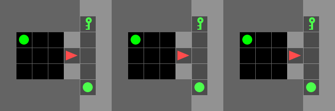
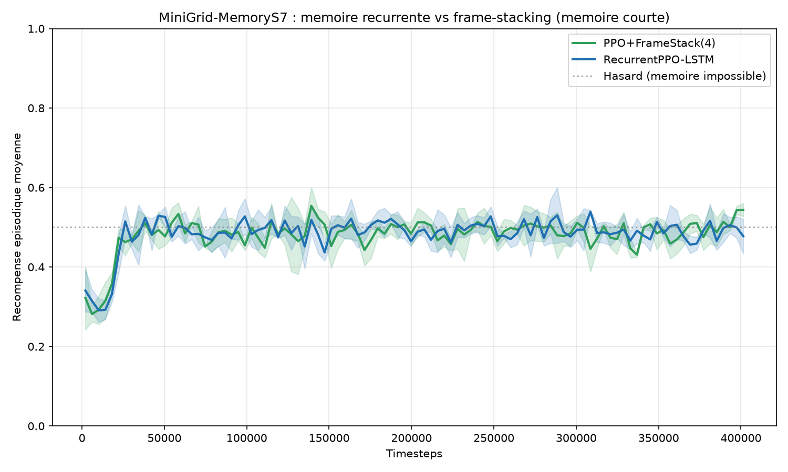

# PPO under Partial Observability

**Experimental study of Proximal Policy Optimization under partial observability using CartPole-MaskedVelocity, FrameStack, RecurrentPPO-LSTM, and MiniGrid memory environments.**

This project was developed as part of a Reinforcement Learning course. It is based on the paper:

> Schulman et al. (2017), *Proximal Policy Optimization Algorithms*.

The main objective is not only to train PPO on a standard environment, but to study how PPO behaves when the agent loses part of the state information, and how different memory mechanisms can recover performance.

---

## Project idea

Standard CartPole is a fully observable Markov Decision Process. The observation contains:

```text
[x, x_dot, theta, theta_dot]
```

In this project, we create a partially observable version of CartPole by masking the velocity components:

```text
[x, theta]
```

This makes the task harder because the agent no longer directly observes the dynamics of the system.

We compare several approaches:

| Agent             | Environment             | Memory mechanism           |
| ----------------- | ----------------------- | -------------------------- |
| PPO-MLP           | CartPole-v1             | none                       |
| PPO-MLP           | CartPole-MaskedVelocity | none                       |
| PPO-FrameStack    | CartPole-MaskedVelocity | explicit short-term memory |
| RecurrentPPO-LSTM | CartPole-MaskedVelocity | recurrent memory           |

The central research question is:

> Can memory recover the performance lost by PPO under partial observability?

---

## Main result

The core result is that PPO-MLP performs very well on fully observable CartPole, but collapses when velocity information is removed. Adding memory recovers most of the lost performance.

| Agent                     | Implementation | Mean evaluation return | Std across seeds |
| ------------------------- | -------------- | ---------------------: | ---------------: |
| PPO-MLP / MDP             | from scratch   |                 487.17 |            12.21 |
| PPO-MLP / POMDP           | from scratch   |                  40.57 |             0.28 |
| PPO-FrameStack / POMDP    | from scratch   |                 493.57 |            11.01 |
| RecurrentPPO-LSTM / POMDP | sb3-contrib    |                 275.33 |           100.45 |

The results show that:

* PPO-MLP solves the fully observable CartPole task.
* PPO-MLP fails when velocities are masked.
* FrameStack almost fully recovers performance.
* RecurrentPPO-LSTM also recovers performance, but with higher variance across seeds.



---

## Visual demonstrations

The following visual examples illustrate the behavior of different agents.

### Random agent

The random agent fails almost immediately.



### PPO-MLP on fully observable CartPole

When the full state is available, PPO-MLP learns a stable control policy.



### PPO-MLP on CartPole-MaskedVelocity

When velocity information is removed, the MLP policy struggles because it cannot directly infer the system dynamics.



### PPO with FrameStack on CartPole-MaskedVelocity

FrameStack provides a short history of observations. This allows the agent to implicitly recover velocity-like information from successive positions.



### RecurrentPPO-LSTM on CartPole-MaskedVelocity

The LSTM policy uses recurrent memory to handle partial observability. It learns useful behavior, but the results are more variable than FrameStack in this experimental setup.



---

## CartPole visual summary

The figure below summarizes representative behaviors of the different agents.



---

## MiniGrid exploration

In addition to CartPole, the project includes an exploratory extension on MiniGrid memory environments.

The purpose of the MiniGrid part is to test memory-based agents in an environment where remembering previous observations is more directly relevant.

This part is presented as an exploratory study, not as the main conclusion of the project.

### MiniGrid examples

| MLP                                                 | FrameStack                                                        | LSTM                                                  |
| --------------------------------------------------- | ----------------------------------------------------------------- | ----------------------------------------------------- |
|  |  |  |

### MiniGrid comparison



The MiniGrid results are less conclusive than the CartPole results and would require additional tuning. They are useful as a complementary exploration, but the main experimental evidence of the project comes from CartPole-MaskedVelocity.



---

## Implementation overview

The project contains:

* a PPO-MLP implementation from scratch in PyTorch;
* a `MaskVelocityWrapper` to create CartPole-MaskedVelocity;
* a `FrameStackWrapper` to add explicit memory;
* harmonized evaluation scripts;
* visual generation scripts for videos and GIFs;
* RecurrentPPO-LSTM experiments using `sb3-contrib`;
* exploratory MiniGrid memory experiments.

The LSTM comparison uses `RecurrentPPO` from `sb3-contrib`, because recurrent PPO is more delicate to implement correctly from scratch due to hidden-state handling, sequence batching, and episode boundary management.

This choice is explicitly documented in the report.

---

## Repository structure

```text
ppo-recurrent-pomdp/
├── notebooks/
│   ├── 01_ppo_mlp_cartpole.ipynb
│   ├── 02_pomdp_wrappers.ipynb
│   ├── 03_ppo_lstm_cartpole.ipynb
│   ├── 04_results_analysis.ipynb
│   ├── 06_minigrid_memory_study.ipynb
│   └── 07_minigrid_visualizations.ipynb
│
├── scripts/
│   ├── phase_B_multiseeds.py
│   ├── phase_E_harmonized_eval_fromscratch.py
│   ├── phase_F_generate_cartpole_videos.py
│   ├── phase_G_visual_assets.py
│   └── phase_H_minigrid_memory_sb3.py
│
├── src/
│   ├── envs/
│   │   ├── pomdp_wrappers.py
│   │   └── minigrid_wrappers.py
│   ├── agents/
│   └── utils/
│
├── results/
│   ├── csv/
│   ├── gifs/
│   ├── videos/
│   └── models/
│
├── report/
│   └── figures/
│
├── requirements.txt
├── SETUP.md
└── README.md
```

---

## Main scripts

### Harmonized evaluation

```bash
python scripts/phase_E_harmonized_eval_fromscratch.py
```

This script trains and evaluates the from-scratch PPO agents on three seeds and produces the final comparison table.

Main output:

```text
results/csv/harmonized_eval/final_harmonized_results_summary.csv
report/figures/final_harmonized_eval_comparison.png
```

### CartPole videos and GIFs

```bash
python scripts/phase_F_generate_cartpole_videos.py
python scripts/phase_G_visual_assets.py
```

These scripts generate videos, GIFs, and visual snapshots of the trained CartPole agents.

### MiniGrid memory experiments

```bash
python scripts/phase_H_minigrid_memory_sb3.py
```

This script runs the exploratory MiniGrid memory experiments.

---

## Installation

Create and activate a Python virtual environment:

```bash
python -m venv .venv
```

On Windows:

```bash
.venv\Scripts\activate
```

On Linux/macOS:

```bash
source .venv/bin/activate
```

Install dependencies:

```bash
pip install -r requirements.txt
```

Depending on your environment, you may also need:

```bash
pip install stable-baselines3 sb3-contrib gymnasium[classic-control] imageio imageio-ffmpeg
```

---

## Reproducibility

Most experiments use three seeds:

```text
seed = 1, 2, 3
```

The main reported metric is the deterministic evaluation return over 20 episodes after training.

For CartPole-v1, the maximum return is 500.

---

## Key interpretation

The main conclusion is:

> Partial observability strongly degrades PPO-MLP when velocity information is removed. A simple explicit memory mechanism such as FrameStack can almost fully recover performance. Recurrent memory with LSTM also helps, but in this setup it is more variable and more sensitive to implementation details.

This supports a practical lesson in reinforcement learning:

> Before using complex recurrent architectures, it is important to compare them against simple and strong memory baselines such as FrameStack.

---

## Academic honesty

This project combines:

| Component                       | Source                       |
| ------------------------------- | ---------------------------- |
| PPO paper                       | Schulman et al. (2017)       |
| PPO-MLP implementation          | from scratch in PyTorch      |
| CartPole-MaskedVelocity wrapper | custom implementation        |
| FrameStack wrapper              | custom implementation        |
| Recurrent PPO-LSTM              | `sb3-contrib` implementation |
| MiniGrid experiments            | exploratory extension        |

The report clearly distinguishes between from-scratch components and external library components.

---

## Main reference

```bibtex
@article{schulman2017ppo,
  title={Proximal Policy Optimization Algorithms},
  author={Schulman, John and Wolski, Filip and Dhariwal, Prafulla and Radford, Alec and Klimov, Oleg},
  journal={arXiv preprint arXiv:1707.06347},
  year={2017}
}
```

---

## Author

**Pape Malick DIOP**
Master student in Data Science and Artificial Intelligence
Université Iba Der THIAM de Thiès
