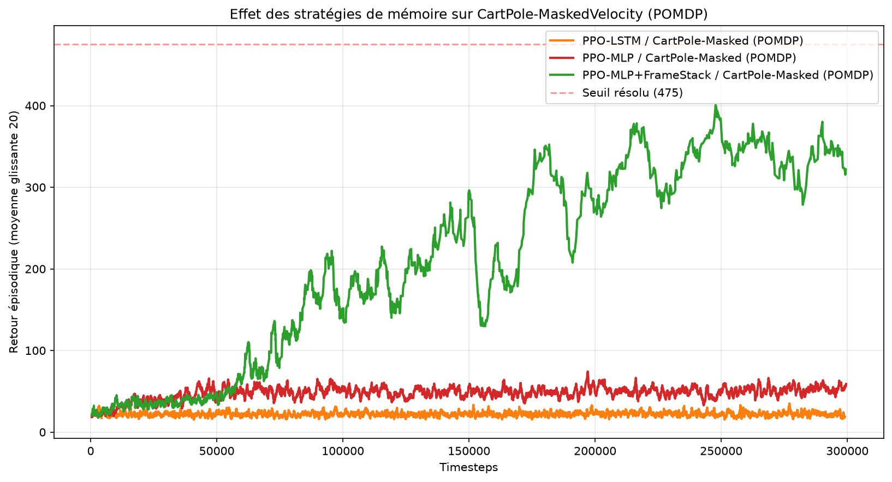
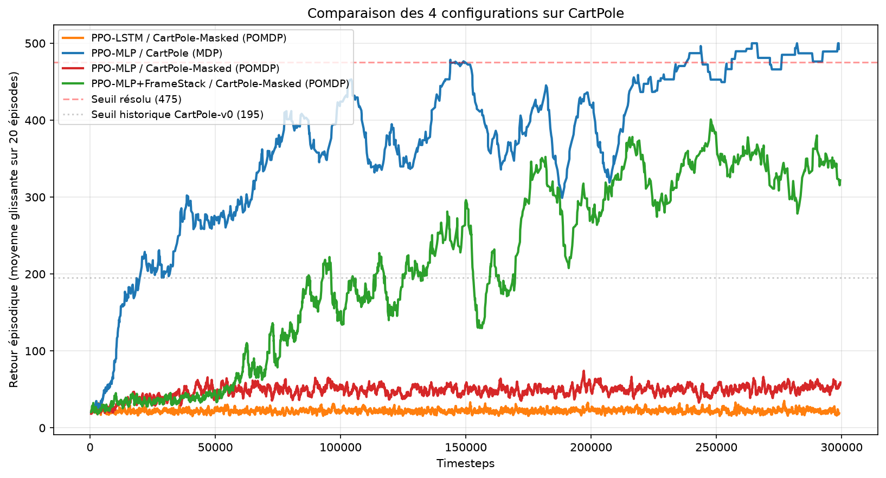

# Conversion du rapport en PDF

## Option 1 — VSCode (le plus simple)

1. Installe l'extension **"Markdown PDF"** (yzane.markdown-pdf) dans VSCode
2. Ouvre `report/rapport.md`
3. `Ctrl+Shift+P` → `Markdown PDF: Export (pdf)`
4. Le PDF est créé à côté du fichier .md

## Option 2 — Pandoc (ligne de commande)

```bash
# Installer pandoc
# Sur Windows : winget install pandoc
# Sur Mac : brew install pandoc
# Sur Ubuntu : sudo apt install pandoc texlive-xetex

# Convertir
pandoc report/rapport.md \
  -o report/rapport.pdf \
  --pdf-engine=xelatex \
  -V geometry:margin=2.5cm \
  -V mainfont="DejaVu Sans" \
  -V monofont="DejaVu Sans Mono" \
  --toc \
  --toc-depth=2
```

## Option 3 — Conversion en ligne (sans installer)

1. Va sur https://md-to-pdf.fly.dev/
2. Copie-colle le contenu de `rapport.md`
3. Télécharge le PDF

## ⚠️ Pour les figures

Avant de convertir, **insère les figures manuellement** dans le rapport aux endroits indiqués par `**Figure 1**` et `**Figure 2**` :

```markdown
**Figure 1** : Effet des stratégies de mémoire sur le POMDP.



**Figure 2** : Comparaison globale incluant le MDP.


```

Si tu utilises pandoc, les chemins relatifs marchent à condition de lancer pandoc depuis le dossier `report/`.
